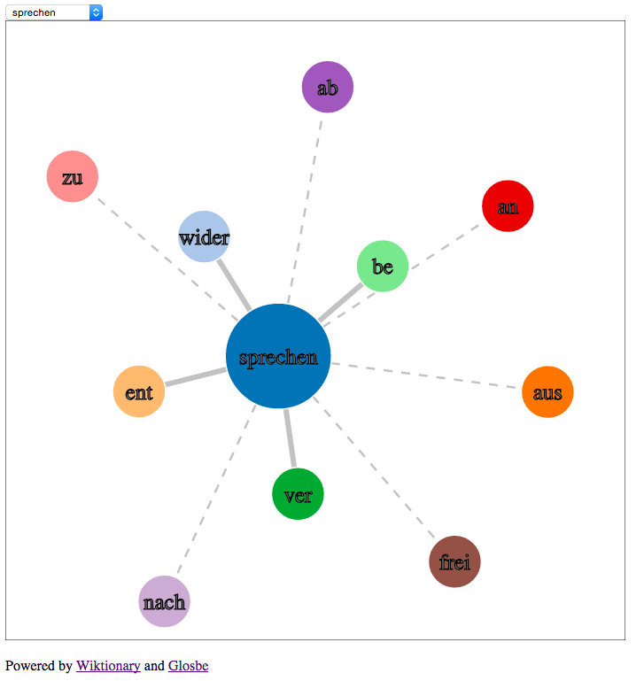

# German Verb Visualization

### Introduction
German is an infamously difficult language to learn. One particularly difficult aspect of the language is separable and inseparable verbs. Verbs are commonly formed by adding prefixes to simple verb roots. The word go (*gehen*) can be used to derive words such as *upgo* (rise, *aufgehen*), *aroundgo* (circumvent, *umgehen*), and *withgo* (accompany, *mitgehen*). Some of these words (such as *upgo*, *aufgehen*) are separable, so that the prefix separates from the verb root when the word is conjugated. For example, I **go** the mountain **up** (Ich **gehe** den Berg **auf**). Some verbs are inseparable, so they stay together when conjugated. For example, I **aroundgo** the obstacle (Ich **umgehe** das Hindernis). Intermediate German learners reach a stage in language learning where they see this pattern but cannot see the system as a whole.


This visualization helps German language students understand this facet of the language. The user can select from more than five hundred verb roots (such as the German words for go (*gehen*), see (*sehen*), speak (*sprechen*), and take (*nehmen*)). The root of the word and each prefix are represented as nodes. Each prefix-node is connected to the verb root node with a line. The separable verbs are represented by long dashed lines and the inseparable verbs are represented by short solid lines. The visualization is interactive and it behaves like balls connected by springs (i.e. a force-directed graph). When the user clicks on a node (prefix or root), the node inflates to three times its size, displays the translation for a couple of seconds, shrinks back to its original size, and displays the original German word. For example, when the user clicks on *with* in the graph of *go* (corresponding to *withgo*), the clicked node displays the word accompany.

### Data
Data was collected using the [German Wiktionary](https://de.wiktionary.org/wiki/Wiktionary:Hauptseite) and [GLOSBE](https://en.glosbe.com/) dictionaries. The `buildRelations.py` script creates a csv file, which is then turned into json that d3 uses. The `jsonizer.py` script converts the csv file into the json object needed by the script. 

Questions? Comments? Suggestions? Don’t hesitate to contact me!